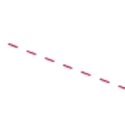

## Deployment architecture

 
<!-- This generates a picture based on deployment.md. To change the counter in the url above, i.e. servers.plantuml?13 -> servers.plantuml?14 -->

### Peruskokoonpanot

#### Peruskokoonpano
- 3+n kappaletta
- CentOS 7, Ubuntu 16 or Debian 8
- 32G+ RAM
- 4+ CPU
- 250G+ SSD storage
- 2 NIC

#### Integraatiopalvelin
- 2+n kappaletta
- CentOS 7, Ubuntu 16 or Debian 8
- 16G+ RAM
- 4+ CPU
- 250G+ SSD storage
- 2 NIC

#### Proxypalvelin
- 2+n kappaletta
- CentOS 7, Ubuntu 16 or Debian 8
- 16G+ RAM
- 4+ CPU
- 250G+ SSD storage
- 4 NIC

#### Continuous Integration Server
- 1 kappale
- CentOS 7, Ubuntu 16 or Debian 8
- 32G+ RAM
- 8+ CPU
- 250G+ SSD storage
- 4 NIC

### Kapasiteettipalveluja
- Backup

### Asiantuntijapalvelut
- Sysadmin palvelut 24/7
- Ylläpitoasiantuntija t&m
- Konesaliasiantuntija/arkkitehti t&m

### Optiona
### Kapasiteettipalveluja optiona
- SAN kasvattaminen ainakin 100T asti. SAN redundancy respective to network environment.
- NAS low tier
- Virtuaalipalvelin

#### Database Server
- 2+n kappaletta
- CentOS 7, Ubuntu 16 or Debian 8
- 32G+ RAM
- 4+ CPU
- SAN 1T+ Storage
- 2 NIC

#### Logging Server
- 2+n
- CentOS 7, Ubuntu 16 or Debian 8
- 16G+ RAM
- 4+ CPU
- SAN 1T+ Storage
- 2 NIC

#### Integration Security Server
- CentOS 7 or Ubuntu 14
- 16G+ RAM
- 4+ CPU
- 250G+ SSD storage
- 2 NIC

#### Temporary Server
- CentOS 7, Ubuntu 16 or Debian 8
- 8G+ RAM
- 2+ CPU
- 100G+ storage
- 1 virtual NIC

#### Verkkopalveluja
- Palomuuri, VLAN ja Loadbalancer

### Symbol
| Logical connections        | Optional connections           | Physical connections  |
| ------------- |:-------------:| -----:|
|       |  |  |
